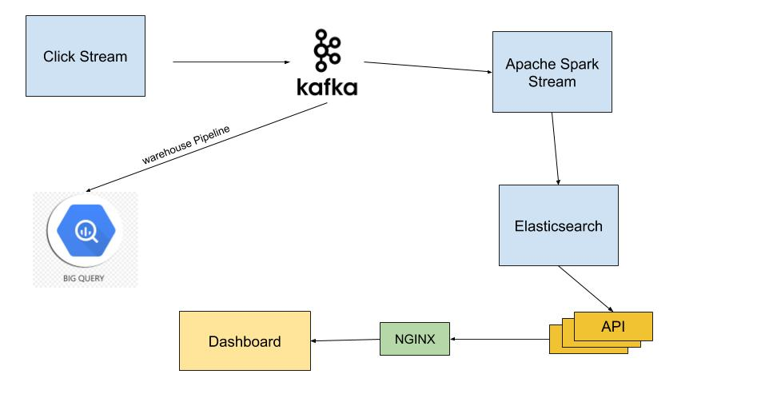
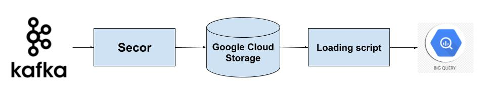

# Insider Project
### Use Cases
- Keeping the system scalable, low latency and fault-tolerant.
- Analytics of the data to be able to report all the sessions/users.
- Processing the data in real-time. e.g Last visits, purchases, cart amounts, pre-defined events
(add to cart, whishlisted products) of each user.
- Making predictions of the data in daily basis.
- Recognize users across different devices. To be able to make unficiation.

### Constraints
For this problem, I am constraining solution to these parameters:
- Keep track of last_visit of each user 
- Keep track of total purchases made by an user till date
- Take any action on predefined events such as sending push notification on add_to_cart event

# High Level Design


# Core Components

### ClickStream- Ingestion Service
#### Use Case 
- To ingest data from different sources at the scale of 300 million raw events 

> Technologies: nodejs, EC2 or google servers, kafka (as producers)

### Architecture
- It is a stateless system.
- It receives data from the stream and produces it in kafka.
- As the system is stateless, this can be put on autoscaled mode.
> Nodejs: It is asynchronous and event driven, can process thousands of events concurrently and efficiently.

## Speed Layer
### Use cases
- Processing real time data 
- Serves the most recent data continuously as new data arrives
- Maintain different profiles for different users
- Recognize new users
- Regularly update profiles of each user like last visits, total purchases
- Take an action on pre-defined events like sending a promotional web push on add_to_cart event

> Technologies used: Kafka, Apache Spark

#### Kafka Architecture
Why ??
- It is a publish-subscribe messaging system.
- Kafka is a fast, scalable, distributed in nature by its design, partitioned and replicated commit log service.
- It stores data persistently, durable at high traffic, fault tolerant. 
- It will act as a shock absorber in the data pipeline.

Architecture for our use case:
> Brokers - 3 or 4 (Depends on the level of replication needed)
> Topics -  single topic 
> Partitions -  100 

> You need to process around 350K messages per minute. Using 100 partitions, you must have 100 consumer threads. One possible scenario - 10 consumers instances each having 10 threads. Each thread can efficiently process 3.5K messages per minute.

- Partitioning logic: (partner_id % 100). It is based on user_id because we should keep track of same client’s users in case of any issues.
- Format of data: JSON (for additional metadata, we can prefer other formats like transit)
It is linked to Apache Spark which then processes data in real-time

### Apache Spark
Why??
- It is a fast and general purpose cluster computing system for large scale data processing.
- Highly parallel, and fault-tolerant. Well suited for our purpose

Architecture for our use case:
> Batch interval -- 30 sec (updates profiles in elasticsearch every 30 secs)
> DStream - It will be created to stream data from kafka. Each data in a DStream is a map representing an user event.

This will process the event and sync updated result with Elasticsearch.

### ElasticSearch
Why?? 
- It is a full text search and analytics engine. Thus, can perform queries like get me all events for a user with particular session ids, etc.
- It can be used to persist data. 

Details
- It will maintain profiles of unique users i.e. single document for each user.
- All the fields in this document will be not analyzed as our use case doesn’t demand full text search.
- Web portal can ask for different search and lookup queries using an HTTP endpoint.

Sample user profile document in Elasticsearch:
```
{
    "session_id": "995a888d-69a9-3779-9c91-0bb7ff7114c8_1510761641",
    "partner_id": "00215",
    "partner_name": "lcwaikiki",
    "country": "TR",
    "user_id": "3939a171d2ce3.4126983939a",
    "version": "1.0",
    "language": "tr_TR",
    "last_visit": 1510758058,	// ts when user has done an activity last time
    "category": ["Kız Bebek", "Tişört, Body ve Atlet"],
    "referrer": "http://www.lcwaikiki.com/tr-TR/TR",
    "total_purchases": "5000",	// total purchases made by an user till date				
    "user_agent": "Mozilla/5.0 (Linux; Android 6.0.1; SAMSUNG SM-J700F Build/MMB29K) AppleWebKit/537.36 (KHTML, like Gecko) SamsungBrowser/5.4 Chrome/51.0.2704.106 Mobile
Safari/537.36"
}
```

#### Detailed discussion on Speed Layer
This creates a kafka stream, processes events and syncs update profile of an user in Elasticsearch. 
Sample Scala code is explained below:

1.1 Declaring config variables
``` scala
val conf = new SparkConf()
      .setAppName("InsiderProject") // project name
      .setMaster("local")       // running on local


val sc = new SparkContext(conf)
val sqlContext = new SQLContext(sc)
val kafkaTopics = "insiderevents"    
val kafkaBrokers = "localhost:9092"   
// analyzing events for last 30s and syncing with ES
val batchIntervalSeconds = 30 
//create a checkpoint directory to periodically persist the data since we are using stateful transformations
val checkpointDir = "/usr/local/Shashank/Kafka/checkpoint" 
```

1.2 If any Spark Streaming Context is present, it kills and launches a new ssc
``` scala
val stopActiveContext = true
if (stopActiveContext) {
    StreamingContext.getActive.foreach { _.stop(stopSparkContext = false) }
}
```

1.3 Create Kafka Stream with the Required Broker and Topic
``` scala
def kafkaConsumeStream(ssc: StreamingContext): DStream[(String, String)] = {
    val topicsSet = kafkaTopics.split(",").toSet
    val kafkaParams = Map[String, String]("brokers.list" -> kafkaBrokers)
    KafkaUtils.createDirectStream[String, String, StringDecoder, StringDecoder](
        ssc, kafkaParams, topicsSet)
}
```

1.4 Define a spark streaming context with batch interval of 30 seconds
``` scala
val ssc = new StreamingContext(sc, Seconds(batchIntervalSeconds))
```

1.5 Get the event stream from the Kafka source and mapping events to their session_ids
``` scala
val eventStream = kafkaConsumeStream(ssc).flatMap { event => {event.session_id : [event]} }
    // Create a stream to update total purchases by that user till date and update timestamp for that user
val updateFunc = (values: Seq[Map], state: Option[Map]) => {
      val session_id = values.session_id
      val previous_state = state.getOrElse(session_id)
      previous_state['last_visit'] = values.date
      previous_state['total_purchases'] += values.cart_amount
      Some(previous_state)
}
```

While consuming events, if an event is of custom type, then take certain action based on type of event. 

1.6 For each event in the data stream, I am updating the last_visit and total purchases made till date
``` scala
val userProfileUpdateStream = eventStream.map { x => x }.updateStateByKey(updateFunc)
```
   
1.7 Create temp table at every batch interval and updates document in Elasticsearch
``` scala
 val fields = [
    "session_id", 
    "partner_id",
    "partner_name"
    "country",
    "user_id",
    "version",
    "language",
    "last_visit", 
    "category",
    "referrer",
    "total_purchases",        
    "user_agent"]

userProfileUpdateStream.foreachRDD { rdd =>
      val sqlContext = SQLContext.getOrCreate(SparkContext.getOrCreate())
      val wordCountdf = sqlContext.createDataFrame(rdd).toDF(fields)
      wordCountdf.show()
      
      //Updates documents in elasticsearch index 'users'. 
      import org.elasticsearch.spark.sql._
      wordCountdf.updateToEs("users/users")
    }
```

1.8 To make sure data is not deleted by the time we query it interactively
``` scala    
ssc.remember(Minutes(1))
ssc.checkpoint(checkpointDir)
```
### Tune performance on speed layer
- We can increase the number of topics such that one kafka input Dstream is recieving only one topic. This will parallelize recieving data and thus increase overall throughput. 
- Data serialization is an overhead. We can standardize the serialization format to overcome this overhead.
- Setting the right batch interval can have a significant effect. Depends on the nature of the streaming computation, in our case updates in ES, we should test and iterate over this parameter.


## Data Warehousing Pipeline
### Use cases
- A warehouse to store historical data which can be used for analytics, Business Intelligence.
Design.
- Will be running machine learning algorithms to predict data daily.


Why BigQuery?? 
- It is fully managed persistent data warehouse
- Highly available and performant for running complex queries (e.g. joins)
- Since, we need to store data for analysis later in time. There is no need to stream data to BigQuery. We will rather use batch upload solutions.



 

- We will use secor to dump kafka logs to Google cloud storage persistently. Then a loading script will insert data in BigQuery in batch.
- Partitioned table will be created in BigQuery day wise, based on event_time field in kafka message.

``` sh
CREATE TABLE mydataset.newtable 
(session_id VARCHAR(50), event VARCHAR(50), partner_id INT64, partner_name VARCHAR(50), cart_amount INT64, country VARCHAR(20), user_agent VARCHAR(100), user_id VARCHAR(50), version FLOAT, language VARCHAR(20), date DATE, search_query VARCHAR(100), current_url VARCHAR(100), category VARCHAR(50), referrer VARCHAR(50), init_session INT64, page_type VARCHAR(50))
 PARTITION BY date
 OPTIONS(
   partition_expiration_days=3,
   description="a table partitioned by transaction_date"
   )
```

